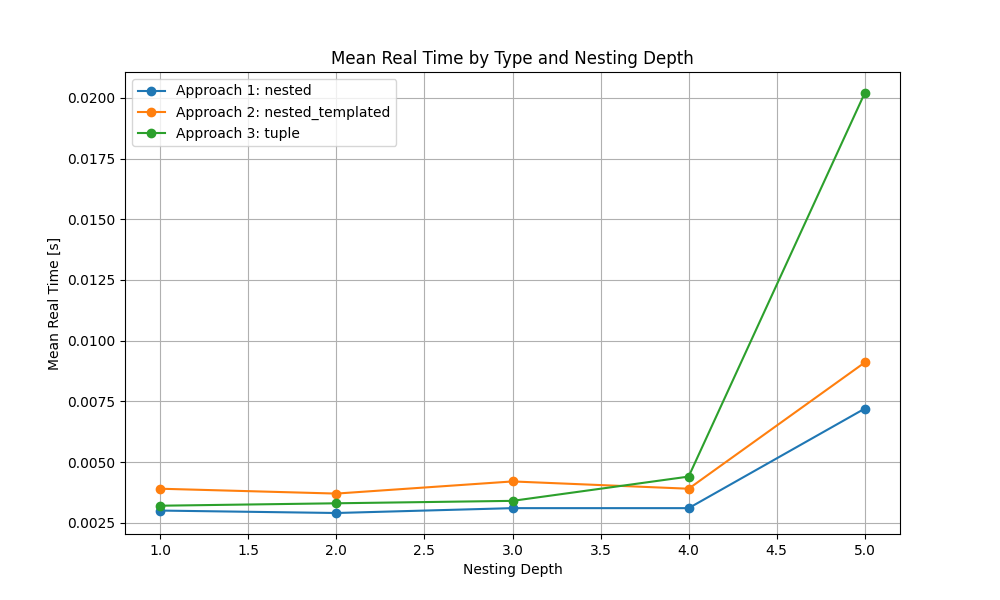

# Introduction

A bunch of utilities to benchmark 3 different approaches to deeply nested key-value maps in C++ on my Intel(R) Core(TM) i7-4800MQ CPU @ 2.70GHz:
 1. simple approach (horrible readibility): `std::map<int, std::map<int, ...>>`
 2. templated nesting: `MultiLevelMap<int, int, ...`
 3. tuples as keys: `std::map<std::tuple<int, int, ....>>`

# Motivation

The motivation for testing various versions is to choose the solution which is most readible and as fast as possible.

# Reproduction

```
bash run.sh
python postprocess.py
```

# Templated approach (Approach no. 2.)

In 2. I'm defining the template as:
```
// Forward declaration of the template class
template <typename... Args>
class MultiLevelMap;

// Specialization for container types like std::vector
template <typename TKey, typename TValue>
class MultiLevelMap<TKey, TValue> {
 public:
  TValue& operator[](const TKey& key) { return data[key]; }
 private:
  std::map<TKey, TValue> data;
};

// Recursive variadic template specialization
template <typename TKey, typename... TKeys>
class MultiLevelMap<TKey, TKeys...> {
 public:
MultiLevelMap<TKeys...>& operator[](const TKey& key) { return data[key]; }
 private:
  std::map<TKey, MultiLevelMap<TKeys...>> data;
};
```

Then you can declare nested maps as just we.g. `MultiLevelMap<int, int, ...> m`.

# Results


