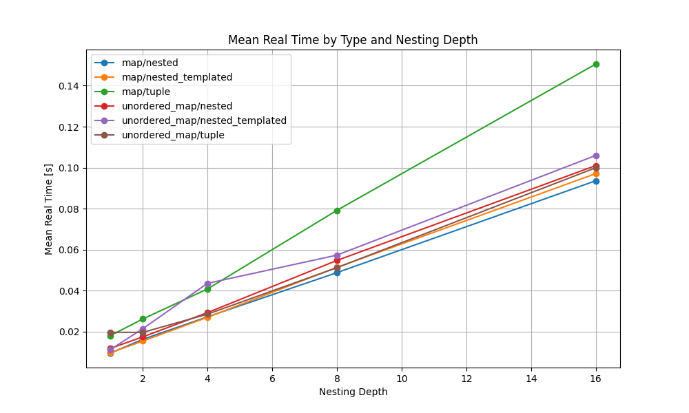

# Introduction

A benchmark testing performance of inserting 65536 values into key-value maps of various depth level in C++ on Intel(R) Core(TM) i7-4800MQ CPU @ 2.70GHz and g++-12.

I'm testing the following map types:
 1. `std::ordered_map`
 2. `std::map`

as well 3 different approachs to map types:
 1. simple approach (horrible readibility): e.g. `std::map<int, std::map<int, ...>>`
 2. templated nesting: `MultiLevelMap<int, int, ...` (see [Templated approach](#templated-approach) for more details)
 3. tuples as keys: e.g. `std::map<std::tuple<int, int, ....>>`

# Reproduction

I was using the [Dockerfile](Dockerfile).

My benchmarking environment:

```
[root@265eda61353b ~]# g++ --version
g++ (GCC) 12.2.1 20221121 (Red Hat 12.2.1-7)
Copyright (C) 2022 Free Software Foundation, Inc.
This is free software; see the source for copying conditions.  There is NO
warranty; not even for MERCHANTABILITY or FITNESS FOR A PARTICULAR PURPOSE.
[root@265eda61353b ~]# lscpu
Architecture:        x86_64
CPU op-mode(s):      32-bit, 64-bit
Byte Order:          Little Endian
CPU(s):              8
On-line CPU(s) list: 0-7
Thread(s) per core:  2
Core(s) per socket:  4
Socket(s):           1
Vendor ID:           GenuineIntel
CPU family:          6
Model:               60
Model name:          Intel(R) Core(TM) i7-4800MQ CPU @ 2.70GHz
Stepping:            3
CPU MHz:             2693.763
BogoMIPS:            5387.52
Hypervisor vendor:   Microsoft
Virtualization type: full
L1d cache:           32K
L1i cache:           32K
L2 cache:            256K
L3 cache:            6144K
Flags:               fpu vme de pse tsc msr pae mce cx8 apic sep mtrr pge mca cmov pat pse36 clflush mmx fxsr sse sse2 ss ht syscall nx pdpe1gb rdtscp lm constant_tsc arch_perfmon rep_good nopl xtopology cpuid pni pclmulqdq ssse3 fma cx16 pdcm pcid sse4_1 sse4_2 movbe popcnt aes xsave avx f16c rdrand hypervisor lahf_lm abm invpcid_single pti ssbd ibrs ibpb stibp fsgsbase bmi1 avx2 smep bmi2 erms invpcid xsaveopt flush_l1d arch_capabilities
```

Steps to reproduce:
```
bash run.sh
```

# Templated approach

In Approach 2. I'm defining the template as:
```
// Forward declaration of the template class
template <typename... Args>
class MultiLevelMap;

// Specialization for container types like std::vector
template <typename TKey, typename TValue>
class MultiLevelMap<TKey, TValue> {
 public:
  TValue& operator[](const TKey& key) { return data[key]; }
 private:
  std::map<TKey, TValue> data;
};

// Recursive variadic template specialization
template <typename TKey, typename... TKeys>
class MultiLevelMap<TKey, TKeys...> {
 public:
MultiLevelMap<TKeys...>& operator[](const TKey& key) { return data[key]; }
 private:
  std::map<TKey, MultiLevelMap<TKeys...>> data;
};
```

Then you can declare nested maps as just we.g. `MultiLevelMap<int, int, ...> m`.

# Results


